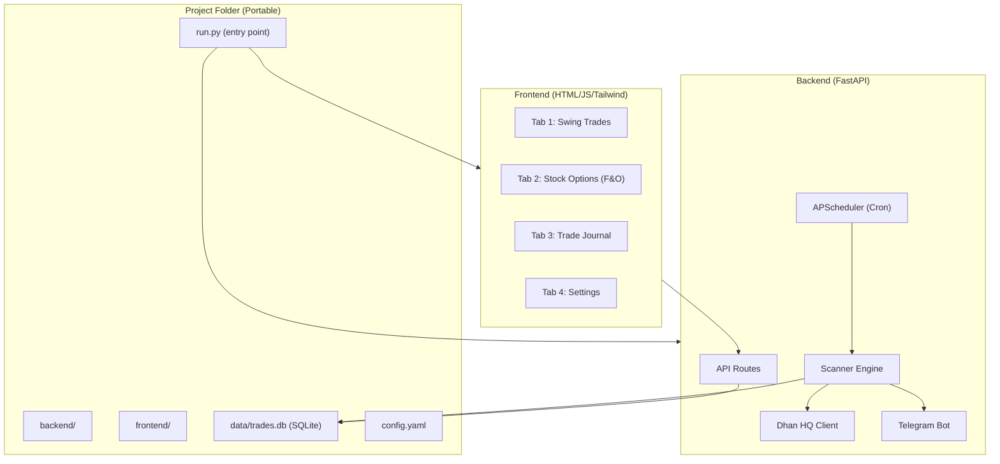
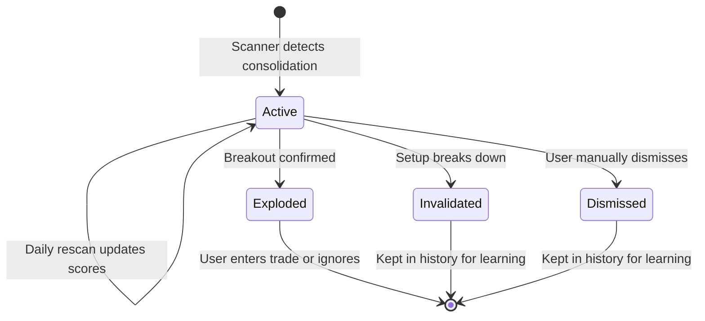
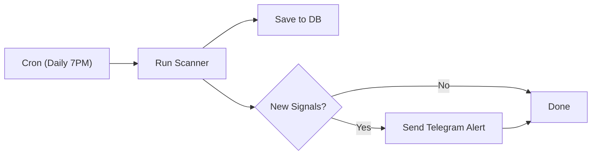

# Trade Scanner Platform - Design Plan

## Architecture Overview

A single portable folder containing everything. One command to start (`python run.py`), SQLite for storage, FastAPI for backend, and vanilla HTML/JS/Tailwind for the frontend.




## Folder Structure

```
dhan/
  run.py                          # Single entry point: python run.py
  requirements.txt                # All Python dependencies
  config.yaml                     # API keys, Telegram bot token, scan settings
  
  backend/
    __init__.py
    app.py                        # FastAPI app creation + static file serving
    config.py                     # Config loader (reads config.yaml)
    
    api/
      __init__.py
      scanner.py                  # API routes for scan results
      journal.py                  # API routes for trade journal CRUD
      watchlist.py                # API routes for custom watchlists
      settings.py                 # API routes for settings management
    
    services/
      __init__.py
      dhan_client.py              # Dhan HQ API wrapper (historical data, instruments)
      instrument_manager.py       # F&O stock list management, instrument CSV parsing
      scanner_engine.py           # Core: Consolidation-Explosion detection logic
      sector_analyzer.py          # Sector momentum / relative strength analysis
      scheduler.py                # APScheduler cron setup
      telegram_notifier.py        # Telegram alert sender
      backup_manager.py           # Database backup: scheduled + manual, configurable path
    
    models/
      __init__.py
      database.py                 # SQLite setup with SQLAlchemy
      schemas.py                  # Pydantic models for API requests/responses
      tables.py                   # DB table definitions
  
  frontend/
    index.html                    # Main SPA with tabs
    css/
      styles.css                  # Custom styles (Tailwind via CDN)
    js/
      app.js                      # Main app logic, tab switching, API calls
      scanner.js                  # Swing trades tab logic
      options.js                  # Stock options tab logic
      journal.js                  # Trade journal tab logic
      charts.js                   # Lightweight charting (Chart.js or similar)
  
  data/
    trades.db                     # SQLite database (auto-created)
```

## Database Schema (SQLite)

**Tables:**

- **instruments** - Cached instrument master from Dhan CSV (security_id, symbol, segment, lot_size, etc.)
- **watchlists** - Custom watchlists (id, name, type: swing/fno)
- **watchlist_items** - Stocks in each watchlist (watchlist_id, security_id, added_manually)
- **signals** - Active signal tracker (id, security_id, symbol, signal_type: consolidation/explosion, occurrence_number, first_detected_date, last_updated_date, current_score, peak_score, status: active/exploded/invalidated/dismissed, invalidation_reason, section: swing/fno, sector)
- **signal_history** - Daily score snapshots for each signal (signal_id, date, bb_width, bb_percentile, atr, atr_ratio, price_range_ratio, volume_ratio, close_price, combined_score) -- enables charting how a setup evolved over days/weeks
- **sector_scores** - Sector momentum data (sector_name, relative_strength, price_action_score, combined_score, date)
- **trades** - Trade journal (id, signal_id, security_id, symbol, trade_type: swing/option, entry_price, exit_price, sl_price, target_price, quantity, entry_date, exit_date, pnl, status: open/closed/sl_hit/target_hit, notes)

### Signal Lifecycle



- **Active:** Consolidation detected, being tracked daily. Score and metrics updated each scan.
- **Exploded:** Breakout confirmed (price closes above upper BB + volume spike). High-priority alert.
- **Invalidated:** Setup failed -- auto-marked when stock breaks below consolidation support or score drops below 0.3. Shown with a visual indicator (e.g., red/strikethrough) so you can see it failed, but not auto-removed.
- **Dismissed:** You manually mark a signal as "not interested". Kept in history for review.

### Recurrence Tracking

When a stock appears on the radar again after a previous signal was dismissed or invalidated, the system creates a **new signal** with an incremented `occurrence_number`. This gives you critical context:

- **How it works:** When creating a new signal, the scanner checks the `signals` table for any previous records with the same `security_id` (regardless of status). It counts them and sets `occurrence_number` accordingly (1st time, 2nd time, 3rd time...).
- **Dashboard display:** A badge/tag shows "2nd time", "3rd time" etc. next to the stock name. Higher recurrence = more prominent visual indicator (e.g., orange for 2nd, red for 3rd+).
- **History link:** Clicking the recurrence badge shows the full timeline of all past signals for that stock -- when it was first detected, what scores it had, how long it consolidated, why it was dismissed/invalidated.
- **Why this matters:** A stock that keeps forming tight consolidation patterns is building a larger base. Repeated appearances often precede stronger breakouts. The recurrence count helps you prioritize these setups with higher conviction.

## Two Main Scanning Sections

### Tab 1: Swing Trades

- **Stock Universe:** Custom watchlists + sector-based scanning
- **Scan Logic:** Consolidation-Explosion on daily candles
- **Display:** Table with stock name, sector, consolidation days, BB width percentile, signal strength score, current price, volume
- **Actions:** Add to trade journal, add to watchlist, view chart

### Tab 2: Stock Options (F&O)

- **Stock Universe:** Only F&O eligible stocks (filtered from Dhan instrument CSV where SEGMENT = 'D' and extracting unique underlying symbols)
- **Scan Logic:** Same Consolidation-Explosion detection, but only on F&O stocks
- **Display:** Same table as swing + lot size column + link to option chain (for later OI/IV analysis in Phase 2)
- **Actions:** Same as swing trades + option-specific fields in journal (strike, expiry, premium)

## Consolidation-Explosion Detection Algorithm

The proposed algorithm uses **three layers** to identify high-probability setups:

### Layer 1: Bollinger Band Width (BBW) Squeeze

- Compute 20-period BB with 2 standard deviations
- Calculate BBW = (Upper Band - Lower Band) / Middle Band
- Compute BBW percentile over last 120 days
- **Flag squeeze** when BBW percentile drops below 20% (i.e., current width is in the lowest 20% of the last 6 months)

### Layer 2: ATR Compression

- Compute 14-period ATR
- Compare current ATR to its 50-day moving average
- **Flag compression** when ATR < 70% of its 50-day average (volatility is drying up)

### Layer 3: Price Range Narrowing

- Measure the high-low range over the last 10 days
- Compare to the high-low range over the last 50 days
- **Flag narrowing** when 10-day range is < 40% of the 50-day range

### Scoring

- Each layer contributes a score (0-1)
- Combined score = weighted average (BBW: 40%, ATR: 30%, Range: 30%)
- Stocks scoring above 0.6 are flagged as "consolidation detected"
- Additional bonus points for: volume dry-up, stock in a momentum sector, near a key support level

### Explosion Detection (Breakout Confirmation)

- Price closes above the upper Bollinger Band after a squeeze period
- Volume spikes above 1.5x the 20-day average volume
- This transitions a "consolidation" signal to an "explosion/breakout" signal

**You mentioned you also have ideas -- we will refine these parameters together once Phase 2 is built.**

## Sector Momentum Analysis (Combined Approach)

### Relative Strength vs Nifty 50

- Compare each sector index return vs Nifty 50 return over 5, 10, 20, 50 days
- Sectors consistently outperforming = "in momentum"

### Price Action

- Check if sector index is making higher highs/higher lows on daily timeframe
- Check if sector index is above its 20-day and 50-day EMA

### Combined Score

- Weighted score from relative strength (50%) + price action (50%)
- Rank sectors and highlight top 3-5 momentum sectors

## Notification Flow




- Daily scan runs via APScheduler (configurable time)
- New signals are saved to DB and pushed to Telegram
- Telegram message includes: stock name, signal type (consolidation/explosion), score, current price

## Trade Journal Features

- **Log trades:** Entry price, SL, target, quantity, notes
- **For options:** Additional fields for strike price, expiry date, premium paid, option type (CE/PE)
- **Auto-calculate:** P&L, risk-reward ratio, days held
- **Status tracking:** Open / Closed / SL Hit / Target Hit
- **Dashboard stats:** Win rate, average P&L, total P&L, best/worst trade

## Database Backup System

### How It Works

- `backup_manager.py` handles all backup logic
- Copies `data/trades.db` to your configured backup folder with a timestamped filename (e.g., `trades_2026-03-05_19-30.db`)
- Uses SQLite's built-in online backup API (`sqlite3.backup()`) for safe, consistent copies even while the app is running

### Configuration (in `config.yaml`)

```yaml
backup:
  path: "/Users/kaushikk/Google Drive/dhan_backups"   # You set this to any folder
  schedule: "daily"          # daily / weekly / manual-only
  time: "20:00"              # When to run auto-backup (after the daily scan)
  keep_last: 30              # Keep last N backups, auto-delete older ones
```

### Features

- **Scheduled backups:** Runs automatically after the daily scan via APScheduler (configurable time)
- **Manual backup:** One-click "Backup Now" button in the Settings tab of the dashboard
- **Configurable path:** Set any local folder, external drive, or cloud-synced folder (Google Drive, Dropbox, OneDrive)
- **Retention policy:** Keeps the last N backups (default 30), automatically cleans up older ones to save space
- **CSV export:** In addition to DB backup, option to export trade journal as CSV for easy viewing in Excel
- **Backup status:** Settings tab shows last backup time, backup folder path, and backup health

### Restore

- To restore: simply copy a backup `.db` file back to `data/trades.db` and restart the app
- A "Restore from Backup" option in Settings tab will list available backups and let you pick one

## Portability

- **Zero external services** beyond Python: No database servers, no Node.js, no Docker
- **SQLite** = single file database, moves with the folder
- **config.yaml** = all credentials in one file (gitignored)
- **requirements.txt** = `pip install -r requirements.txt` on any machine
- **run.py** = single entry point that starts FastAPI with uvicorn

## Implementation Phases

- **Phase 1:** Project setup, Dhan HQ client, instrument management, config system
- **Phase 2:** Consolidation-Explosion scanner engine + sector analyzer
- **Phase 3:** Frontend dashboard with Swing + Options tabs
- **Phase 4:** Trade Journal (full CRUD with P&L tracking)
- **Phase 5:** Scheduler (cron) + Telegram notifications + automated DB backup with configurable path
- **Phase 6:** Refinement -- tune algorithm parameters, add your custom rules, OI/IV analysis (future)

